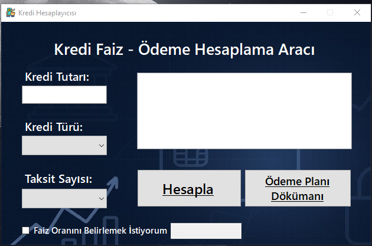
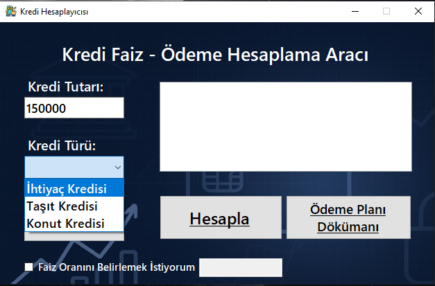
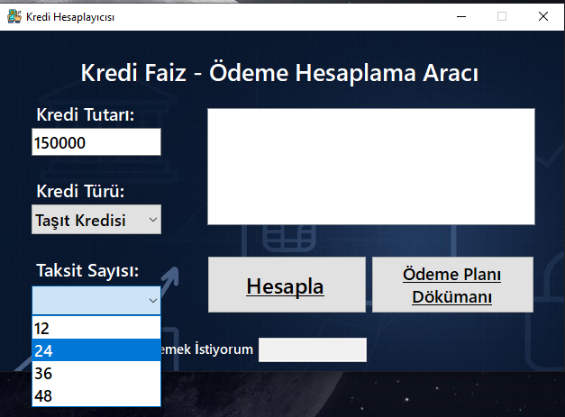
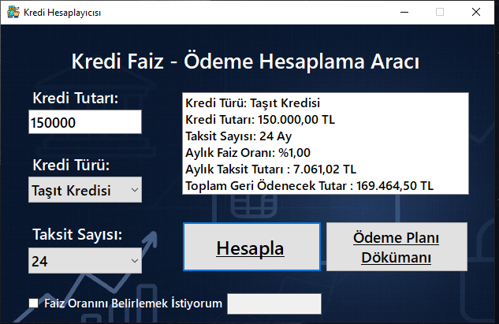
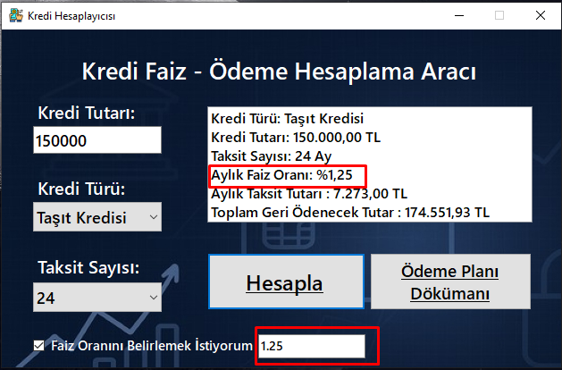

# 💰 Kredi Faiz Hesaplayıcısı

Bu proje, üniversite dönem sonu final ödevi kapsamında geliştirilmiştir.  
Tamamen eğitim amaçlı hazırlanmış olup, gerçek finans kurumlarıyla bağlantısı yoktur.

---

## 🧾 Proje Hakkında

Windows Forms kullanılarak geliştirilmiş masaüstü bir kredi faiz hesaplama uygulamasıdır.  
Kullanıcı, anapara, faiz oranı ve vade bilgilerini girerek aylık taksit ve toplam geri ödeme tutarını hesaplayabilir.

---

## ⚙️ Kullanılan Teknolojiler

- C#  
- Windows Forms  
- .NET Framework / .NET  

---

## ✨ Uygulama Özellikleri

- Anapara, faiz oranı ve vade bilgisi girerek aylık taksit hesaplama  
- Toplam geri ödeme tutarını gösterme  
- Kullanıcı dostu grafiksel arayüz  
- Hatalı veya eksik veri girişine karşı uyarı mesajları  
- Kolay ve hızlı kullanım
- Ödeme çıktısı isteme butonuna basıldıktan sonra excel çıktısı oluşturur

---

## 🖼️ Ekran Görüntüleri

### 🏠 Ana Ekran  


### 📊 Kredi Türü Seçim Ekranı


### 📊 Taksit Sayısı Seçim Ekranı


### 📊 Örnek Sonuç Ekranı 1


### 📊 Örnek Sonuç Ekranı 2 (Faiz manuel olarak belirlenmiştir.)


### 📊 Örnek Excel Tablosu


---

## 📁 Kurulum

Projeyi kendi bilgisayarınızda çalıştırmak için:

```bash
git clone https://github.com/ahmetkavl/KrediFaizHesaplayicisi.git
